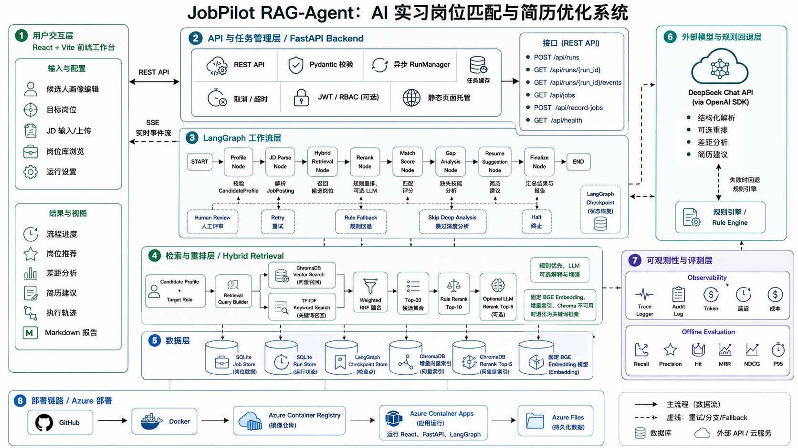

<p align="center">
  <strong>简体中文</strong> | <a href="./README_EN.md">English</a>
</p>

# JobPilot RAG-Agent

面向 AI Agent、RAG 与 LLM 应用实习岗位的智能匹配和简历优化系统。

JobPilot 使用 React + FastAPI 提供交互式工作台，以 LangGraph 编排候选人画像、JD 解析、混合召回、岗位重排、匹配评分、差距分析和简历建议。系统通过确定性规则保证可解释性，并在 DeepSeek 不可用时自动降级，不依赖 LLM 也能完成核心匹配流程。

**在线演示：** [Azure Container Apps](https://jobpilot-agent.gentlefield-019d4ae8.eastasia.azurecontainerapps.io/)

## 系统架构




## 核心功能

- 候选人画像读取、整理与 Pydantic 校验
- JD 结构化解析和 SQLite 岗位库持久化
- BGE 向量检索 + TF-IDF 关键词检索
- Weighted RRF 混合召回
- 规则重排与可选 LLM Top-5 重排
- 可解释的确定性岗位匹配评分
- Top 岗位差距分析和简历优化建议
- LangGraph 条件路由、重试、降级和 checkpoint
- FastAPI 异步任务、SSE 进度、取消与超时
- Trace、延迟、Token 和成本监控
- 离线检索与排序评测

## 系统架构

```text
候选人画像 + 目标岗位 + 岗位 JD
                 |
                 v
        React Agent 工作台
                 |
          REST API + SSE
                 |
                 v
            FastAPI 后端
                 |
                 v
       LangGraph 条件工作流
                 |
   +-------------+--------------+
   |                            |
   v                            v
ChromaDB 向量召回          TF-IDF 关键词召回
   |                            |
   +-------------+--------------+
                 |
          Weighted RRF 融合
                 |
                 v
        规则重排 / 可选 LLM 重排
                 |
                 v
     匹配评分 -> 差距分析 -> 简历建议
                 |
                 v
       推荐结果 + Trace + Markdown 报告
```

LangGraph 主流程：

```text
START
  -> profile_node
  -> jd_parse_node
  -> retrieve_node
  -> rerank_node
  -> match_score_node
  -> gap_analysis_node
  -> resume_suggestion_node
  -> finalize_workflow_node
  -> END
```

流程包含失败终止、人工审核、低分跳过深度分析、LLM 重试和规则降级等条件分支。SQLite checkpoint 支持使用相同 `thread_id` 恢复中断任务。

## 技术栈

- Python 3.10+
- LangGraph
- DeepSeek API / OpenAI SDK
- FastAPI
- Pydantic
- React + Vite
- ChromaDB
- BAAI/bge-small-zh-v1.5
- scikit-learn
- SQLite
- pytest + Playwright
- Docker
- Azure Container Registry
- Azure Container Apps
- Azure Files

## 项目结构

```text
JobPilot-Agent/
├── src/                 # Agent、API、检索、评分、存储和日志
├── frontend/            # React 工作台
├── data/                # 候选人、岗位种子、SQLite 和向量索引
├── eval/                # 离线评测集与评测脚本
├── tests/               # 后端单元与集成测试
├── traces/              # Agent 执行轨迹
├── outputs/             # 推荐结果与 Markdown 报告
├── scripts/             # 初始化和启动脚本
├── portfolio-blog/      # 独立 Astro 项目展示页
├── Dockerfile
└── docker-compose.yml
```

## 本地运行

运行环境：

- Python 3.10.x
- Node.js 20.19.5
- npm 10.x

安装后端依赖：

```powershell
py -3.10 -m venv .venv
.\.venv\Scripts\activate
python -m pip install -r requirements.txt
```

需要与 CI 和容器完全一致的环境时：

```powershell
python -m pip install -r requirements.lock
```

安装前端依赖：

```powershell
cd frontend
npm ci
```

一键构建并启动：

```powershell
.\scripts\start.ps1
```

也可以分别启动：

```powershell
py -3.10 -m uvicorn src.api:app --reload --host 127.0.0.1 --port 8000
```

```powershell
cd frontend
npm run dev
```

访问 `http://127.0.0.1:5173`。

## 环境变量

复制 `.env.example` 为 `.env`：

```env
OPENAI_API_KEY=your_deepseek_api_key
OPENAI_BASE_URL=https://api.deepseek.com
MODEL_NAME=deepseek-chat
LLM_TIMEOUT_SECONDS=60
LLM_SDK_MAX_RETRIES=1
```

API Key 只由 Python 后端读取，不会发送到 React 前端。如果 Key 缺失，系统会使用本地规则完成检索、评分、差距分析和简历建议。

公网部署建议启用认证：

```env
JOBPILOT_AUTH_ENABLED=true
JOBPILOT_JWT_SECRET=<long-random-secret>
JOBPILOT_USER_USERNAME=jobpilot-user
JOBPILOT_USER_PASSWORD=<password>
JOBPILOT_ADMIN_USERNAME=jobpilot-admin
JOBPILOT_ADMIN_PASSWORD=<password>
JOBPILOT_RUNS_PER_MINUTE=10
```

## 检索与索引

- 向量模型固定为 `BAAI/bge-small-zh-v1.5` 及指定 revision。
- ChromaDB 只更新新增、修改或删除的岗位，避免每次运行重建索引。
- TF-IDF 保留 LangGraph、FastAPI、RAG、DeepSeek 等精确关键词。
- Weighted RRF 融合向量排名和关键词排名。
- ChromaDB 或 Embedding 不可用时自动退化到关键词检索。

推荐处理漏斗：

```text
岗位库
  -> Hybrid Retrieval Top-20
  -> Rule-based Rerank Top-10
  -> Optional LLM Rerank Top-5
  -> Match Scoring
  -> Top Jobs Deep Analysis
```

## API

- `GET /api/health`：健康状态和运行配置
- `POST /api/auth/login`：认证启用时签发 JWT
- `POST /api/runs`：创建异步任务
- `GET /api/runs/{run_id}`：读取任务状态和结果
- `GET /api/runs/{run_id}/events`：SSE 节点事件
- `DELETE /api/runs/{run_id}`：取消任务
- `POST /api/runs/{run_id}/review`：人工审核后恢复 checkpoint
- `POST /api/record-jobs`：导入 JD 并增量更新索引
- `GET /api/jobs`：查询有效岗位
- `DELETE /api/jobs/{job_id}`：管理员软删除
- `POST /api/jobs/{job_id}/restore`：管理员恢复岗位

## 测试与评测

后端测试：

```powershell
python -m pytest -q
```

前端测试与构建：

```powershell
cd frontend
npm test
npm run build
```

浏览器冒烟测试：

```powershell
cd frontend
npm run smoke:ui
```

离线评测：

```powershell
py -3.10 eval/run_eval.py
```

评测对比 keyword、vector、hybrid union、weighted RRF 和 RRF + rule rerank，统计 Recall@5/10、Precision@5、Hit@5/10、MRR、NDCG@10、Top-1、平均延迟和 P95 延迟。

## Docker 与 Azure

本地验证生产容器：

```powershell
docker compose up --build
```

线上架构：

```text
GitHub
  -> Docker Multi-stage Build
  -> Azure Container Registry
  -> Azure Container Apps (East Asia)
  -> Azure Files
```

生产容器同时托管编译后的 React 页面和 FastAPI `/api/*`。Azure Files 持久化岗位库和检索索引，DeepSeek 配置通过 Azure Secrets 与环境变量注入。

## 输出文件

- `outputs/matched_jobs.json`
- `outputs/resume_suggestions.json`
- `outputs/final_report.md`
- `traces/latest_trace.json`
- `eval/metrics_report.md`

## 项目亮点

- 使用 LangGraph 构建具有条件路由、人工审核、重试、降级和恢复能力的 Agent 工作流。
- 使用固定 BGE Embedding、TF-IDF 和 Weighted RRF 提升语义与精确关键词召回效果。
- 使用增量 Chroma 索引减少重复 Embedding 开销。
- 使用确定性规则评分控制成本，并提供稳定、可解释的 LLM fallback。
- 使用异步 FastAPI、SSE、任务取消、超时和运行隔离支持真实 Web 工作流。
- 使用 Pydantic、Trace、离线评测、pytest、Playwright 和 GitHub Actions提高工程可靠性。

## 简历描述

设计并实现面向 AI Agent / RAG / LLM 实习岗位的智能匹配系统，使用 LangGraph 编排支持条件路由、重试、人工审核和 checkpoint 恢复的多节点 Agent；基于固定版本 BGE Embedding、TF-IDF 与 Weighted RRF 构建混合检索，并通过增量 Chroma 索引降低重复向量化成本；使用 FastAPI 提供异步任务、SSE 实时进度、取消和超时控制，结合 Pydantic、确定性评分、Trace 和 50 条离线评测集提升系统可解释性与可验证性；通过 Docker、Azure Container Registry、Azure Container Apps 和 Azure Files 完成云端部署。
